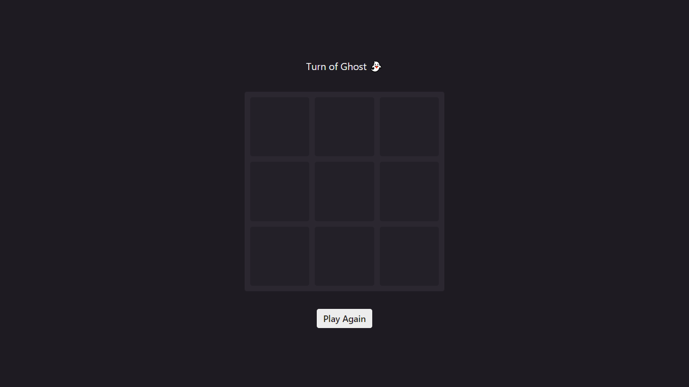
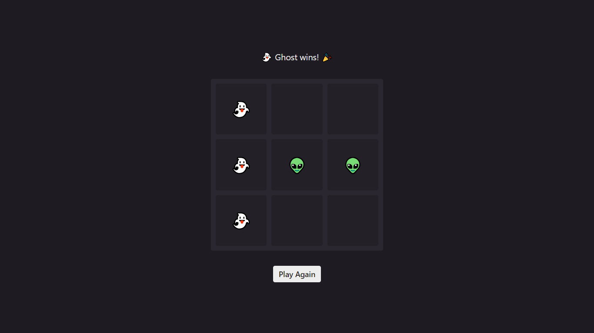
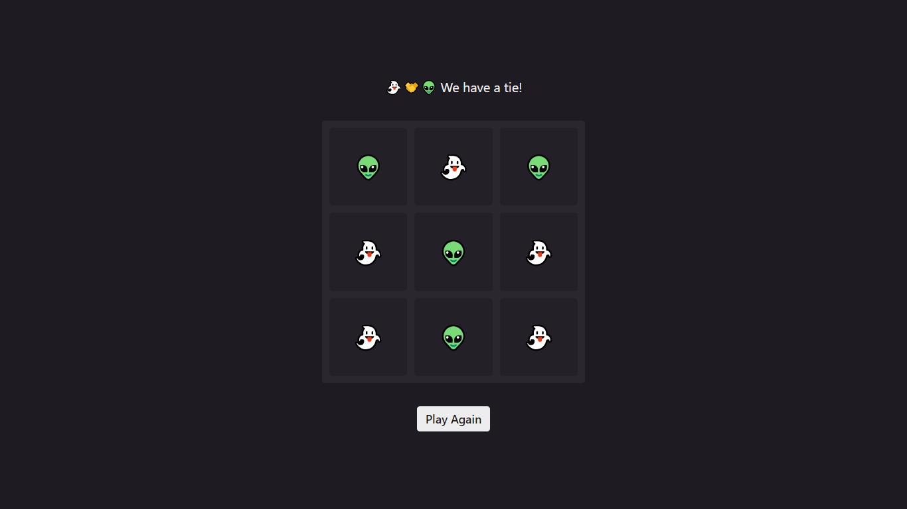

### Emoji Toe

This is a solution to The Odin Project's [Tic Tac Toe](https://www.theodinproject.com/lessons/node-path-javascript-tic-tac-toe). It aims to practice Factory Function and Module Pattern by creating a simple game.

[View demo](#view-demo)
•
[Screenshots](#screenshots)
•
[Built with](#built-with)

#### View demo

[Click here to see the live demo of this project on GitHub Pages.](https://jsklcodes.github.io/emoji-toe)

#### Screenshots

Initial game state

Screen when there's a win

Screen when there's a tie

#### Built with

- CSS custom properties
- CSS Grid
- Factory Function
- Module Pattern
